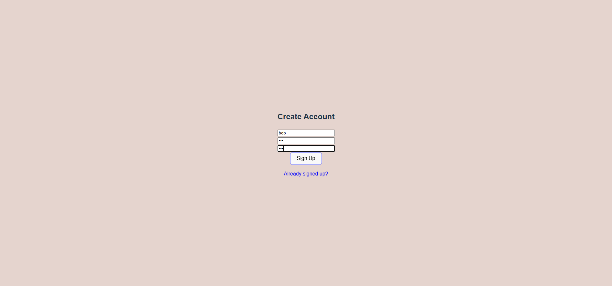

# Greenfield Project Frontend Repository

## Purpose

To help software engineering students improve their skills and knowledge

## Contributors

- Laurence (CC36)
- Vicente (CC36)
- Jason (CC36)

## Technologies Used

- React
- TypeScript

## Setup

1. Clone the repo locally using your preferred method (HTTPS, SSH, etc.)

2. On your local machine, open command line, go to the root directly of the repo, and run `npm install` to install all dependencies

3. Create a `.env` file with a line that says `VITE_API_URL="http://localhost:8080/"`. This is to make your local frontend able to communicate with your local backend

4. Finally, run `npm start` to start the React app and click the `http://localhost:5173/` link that appears in your terminal to view it in your browser

## Application Tour

### Sign Up Screen

### Log In Screen

### New User Login

### Starting Your First Conversation

### Making a New Conversation

### Continuing an Existing Conversation

